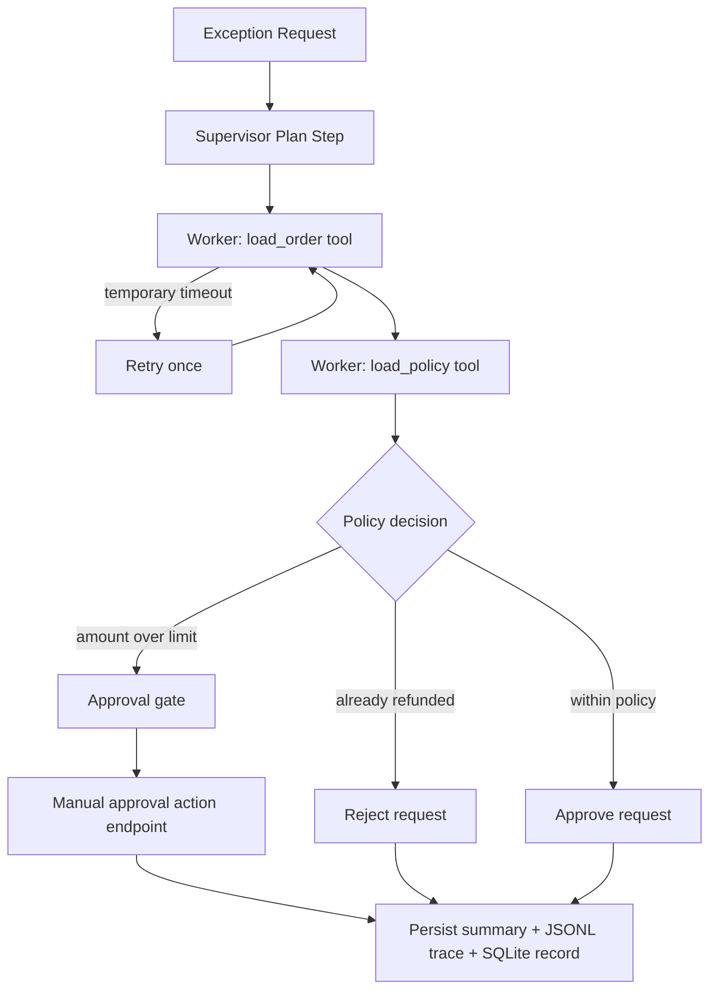

# agent-workflow-studio

`agent-workflow-studio` is a narrow workflow-orchestration demo for purchase-order exception triage. It shows how a supervisor/worker graph can route one business workflow through bounded local tools, one retry branch, one human approval gate, and an auditable execution trace with per-step timing.

## Problem

Refund and exception workflows are a poor fit for an open-ended agent loop. Operations teams need a flow that is easy to debug, easy to constrain, and explicit about when automation should stop and ask for human approval.

In production, the value is not generic autonomy. The value is a single controlled lane that can evaluate one exception, explain why it made a decision, and stop cleanly when the policy says a human needs to look at it.

This repo focuses on one workflow only:

- a purchase-order exception arrives
- the supervisor plans the run
- the worker loads the order and policy context with local tools
- the graph either auto-approves, rejects, or pauses for human approval
- an explicit human action can later approve or reject the paused run through the API

## Architecture



## Execution Flow

This repo is the "Hello World" version of an agent workflow:

1. Input: a purchase-order exception request enters the system.
2. Supervisor: the planner picks the only supported workflow path and decides whether a retry is allowed.
3. Worker: local tools load order and policy context.
4. Decision: the graph approves, rejects, or routes the request to human review.
5. Resolution: paused runs can be resumed later by an explicit approve or reject action.
6. Output: a summary, trace, and SQLite run record are written for later inspection.

## Why This Shape

- A supervisor/worker graph is easier to reason about than a free-running loop.
- Two local tools keep the boundary small and testable.
- A single retry path demonstrates transient failure handling without pretending to solve distributed systems.
- A first-class approval gate makes the stop condition explicit.
- JSONL traces plus a small SQLite run log make the flow inspectable after execution.
- Each persisted step now records attempt count, start/end timestamps, and per-step duration so slow or retry-heavy paths are easy to spot.

## Repository Layout

```text
app/
  cli.py          # local demo entry point
  main.py         # FastAPI app for replaying the workflow
  models.py       # request, state, and trace models
  storage.py      # summary, trace, and SQLite persistence
  tools.py        # local order/policy tools
  workflow.py     # supervisor/worker orchestration
fixtures/
  orders.json
  policies.json
tests/
generated/        # created after demo or API runs
```

## Tradeoffs

- This is intentionally one workflow, not a generic agent platform.
- The tools are local JSON-backed lookups instead of external services so the repo stays deterministic.
- The graph demonstrates control and auditability over breadth.
- The approval gate is modeled as a status transition plus one explicit resume action, not a full human task system.

## Run Steps

### 1. Install dependencies

```bash
python3 -m pip install -r requirements.txt
```

### 2. Run the full local verification flow

```bash
make verify
```

That command runs linting, tests, and a deterministic demo that writes:

- `generated/workflow_summary.json`
- `generated/workflow_trace.jsonl`
- `generated/workflow_runs.sqlite3`

If you only want the shortest version, `python3 -m app.cli demo` runs the same workflow without starting the API server.

### 3. Start the API

```bash
uvicorn app.main:app --host 127.0.0.1 --port 8005
```

### 4. Trigger the default retry scenario

```bash
curl -X POST http://127.0.0.1:8005/runs/demo
```

### 5. Trigger the approval path directly

```bash
curl -X POST http://127.0.0.1:8005/runs \
  -H "Content-Type: application/json" \
  -d '{
    "order_id": "ord_1001",
    "requested_amount": 250.0,
    "reason_code": "damaged_item",
    "simulate_order_lookup_failure": false
  }'
```

### 6. Resolve a paused run explicitly

```bash
curl -X POST http://127.0.0.1:8005/runs/run-id-here/approval \
  -H "Content-Type: application/json" \
  -d '{
    "action": "approve",
    "actor": "finance-manager",
    "note": "Approved after manual policy review."
  }'
```

### 7. Inspect the latest run summary and filtered trace

```bash
curl http://127.0.0.1:8005/runs/latest
curl http://127.0.0.1:8005/runs/latest/trace
```

The summary now includes a `timing_summary` block with:

- total workflow duration
- the slowest recorded step
- a per-step list of attempt counts, statuses, and durations

The trace endpoint returns both the filtered JSONL events and the same run-level timing summary.

## Hosted Deployment

- Live URL: [agent-workflow-studio.onrender.com](https://agent-workflow-studio.onrender.com)
- Open this first: [`/docs`](https://agent-workflow-studio.onrender.com/docs)
- Browser smoke result: Swagger loaded cleanly in a real browser and exposed the health, demo run, custom run, latest run, and trace operations.
- Render config: branch `main`, auto-deploy on commit, runtime `python`, build command `pip install -r requirements.txt`, start command `uvicorn app.main:app --host 0.0.0.0 --port $PORT`, health check path `/health`

## Validation

The repo is only considered publishable when these checks pass:

- `ruff check app tests`
- `pytest -q`
- `python3 -m app.cli demo`

The tests cover:

- retry then auto-approval
- approval-gate routing
- manual approval resolution through the API
- reject path for an already-refunded order
- FastAPI demo and trace endpoints
- CLI output for the timing summary
- persisted timing telemetry in the JSONL trace and SQLite-backed summary payload

## What To Look At First

- `app/workflow.py` for the actual graph logic
- `app/tools.py` for the bounded tool surface
- `app/storage.py` for the audit trail
- `tests/test_workflow.py` for the three business branches plus manual approval resolution
